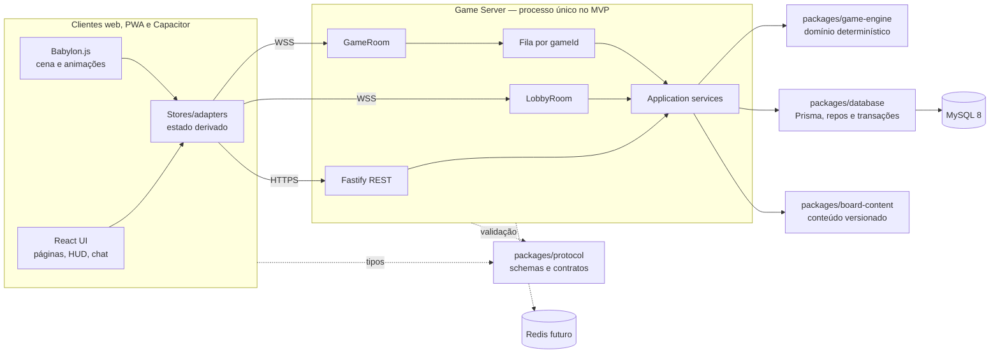
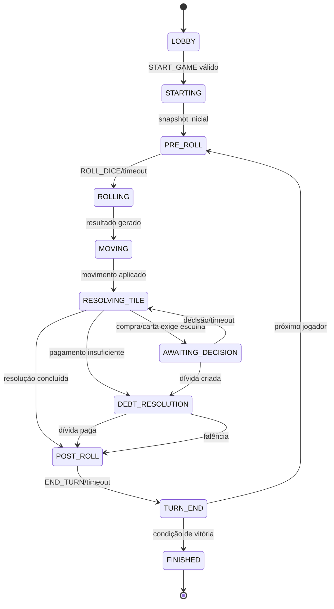
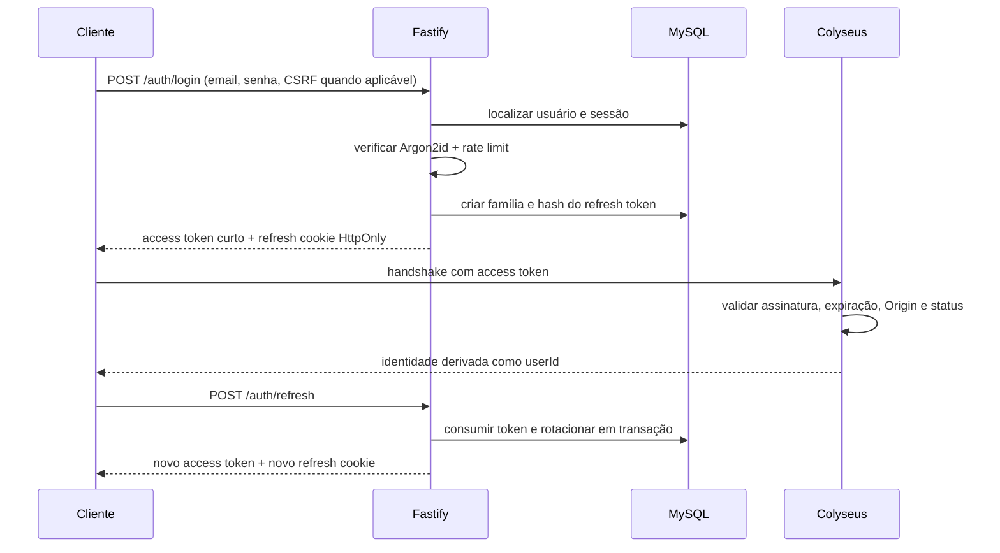
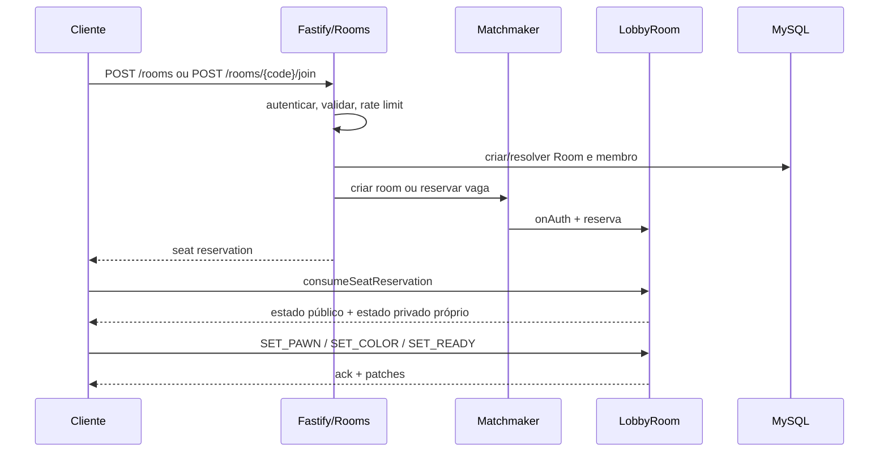
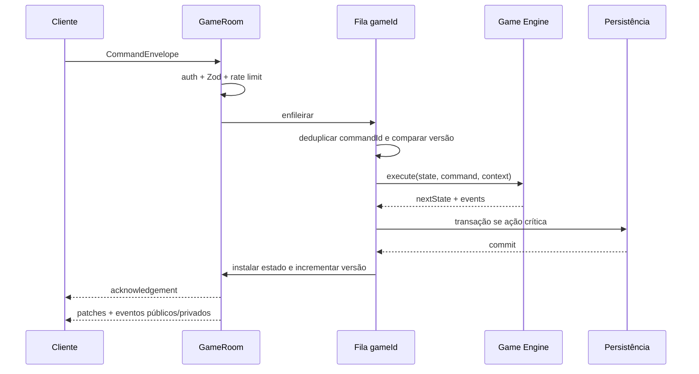
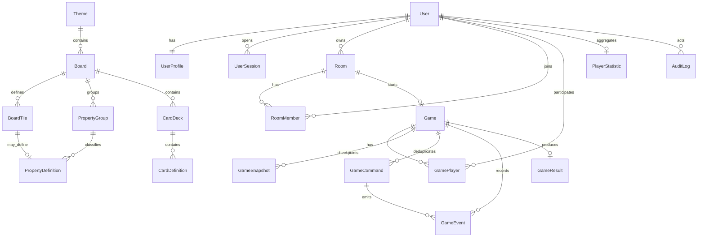
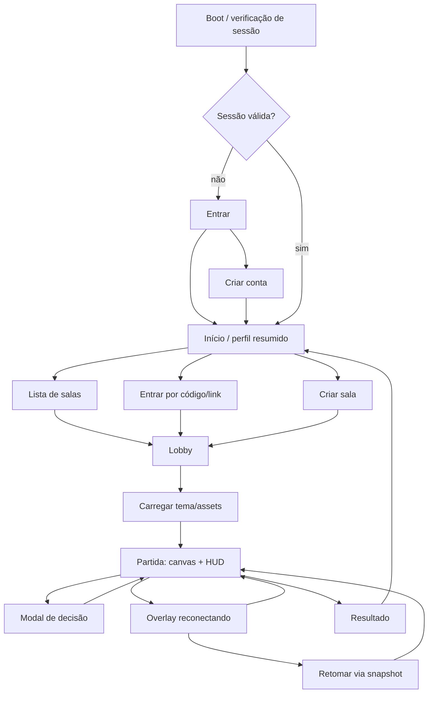

# Fase 1 — descoberta e arquitetura

Status: proposta para aprovação  
Data da baseline: 2026-07-26  
Escopo: somente documentação; nenhuma implementação da Fase 2 foi iniciada.

## 1. Diagnóstico do repositório

O diretório `F:\MyProject` contém somente a pasta `Docs` com nove arquivos
Markdown. Não existem código-fonte, `package.json`, lockfile, workspace,
configurações TypeScript/Biome/Turbo, Docker, CI, testes, assets, schema Prisma,
`AGENTS.md`, `CLAUDE.md` ou README na raiz. O diretório também não está
inicializado como repositório Git.

Consequências:

- o projeto é greenfield e não há compatibilidade retroativa de código a preservar;
- as convenções normativas atuais são os documentos em `Docs`;
- build, typecheck, lint e testes não são aplicáveis nesta fase, pois ainda não há
  código nem ferramentas instaladas;
- Git, monorepo e automações pertencem à Fase 2;
- credenciais locais encontradas em `DATABASE.md` foram removidas da documentação.
  O responsável confirmou que pertencem ao ambiente local de testes; na Fase 2
  elas poderão ficar somente em `.env` ignorado pelo Git.

## 2. Decisões consolidadas

1. Aplicação web-first em monorepo pnpm/Turborepo, com três apps e pacotes
   compartilhados pequenos.
2. Node.js 24 LTS como baseline inicial da Fase 2. A versão exata será fixada em
   `.nvmrc`/`package.json` e nas imagens; versões Current não serão usadas em
   produção.
3. Servidor autoritativo. O cliente envia intenções, nunca resultados.
4. Engine de domínio TypeScript pura, determinística, síncrona e sem I/O.
5. Fastify atende REST; Colyseus atende lobby e partida em tempo real.
6. MySQL 8 é a fonte persistente. Partidas ativas ficam em memória no MVP, com
   snapshots e eventos críticos para recuperação.
7. Uma fila serial por `gameId`, `commandId` idempotente e
   `expectedStateVersion` protegem concorrência e repetição.
8. Estado público usa Colyseus Schema; informações privadas são mensagens
   direcionadas e reconstruíveis.
9. React controla navegação e HUD; Babylon.js controla apenas a cena/canvas.
10. Redis fica atrás de adapters e não é dependência operacional do MVP com uma
    instância.

As justificativas e consequências estão em `Docs/adr/`.

Referências técnicas verificadas em 2026-07-26:

- [Node.js releases](https://nodejs.org/en/about/previous-releases)
- [Colyseus state synchronization](https://docs.colyseus.io/state)
- [Colyseus reconnection](https://docs.colyseus.io/room/reconnection)
- [Colyseus scalability](https://docs.colyseus.io/scalability)
- [Prisma MySQL connector](https://docs.prisma.io/docs/orm/v6/overview/databases/mysql)

## 3. Arquitetura final



### Limites e dependências permitidas

| Módulo | Responsabilidade | Pode depender de | Não pode depender de |
|---|---|---|---|
| `game-client` | UI, input, cena, animação, conectividade | protocol, ui, config | database, regras oficiais |
| `game-server` | HTTP, rooms, auth, filas, orquestração | engine, protocol, database, content, config | UI/Babylon |
| `admin-web` | CRUD administrativo e auditoria | protocol, ui, config | engine e database diretamente |
| `game-engine` | regras, estado e eventos do jogo | somente utilitários internos | rede, framework, SO, relógio, banco |
| `protocol` | Zod, DTOs, códigos, versão | Zod | regras e adapters |
| `database` | Prisma, repos, mappers, transações | Prisma, tipos de aplicação mínimos | React/Babylon |
| `board-content` | schema, validação e seed | Zod, tipos de conteúdo | banco/rede |
| `ui` | componentes visuais reutilizáveis | React/Tailwind | domínio e banco |
| `config` | presets TypeScript/Biome/Vitest | ferramentas | código de produto |

Regra de dependência: apps compõem pacotes; pacotes de domínio não importam apps.
`protocol` não vira um depósito de regras. Tipos internos do engine não são
expostos automaticamente pela rede.

## 4. Estrutura de pastas alvo

```text
apps/
  game-client/
    src/
      app/
      pages/
      features/{auth,rooms,lobby,game,profile}/
      game/
        rendering/
        input/
        animation/
        assets/
        performance/
      services/{api,realtime,storage}/
      stores/
  game-server/
    src/
      http/{plugins,routes,hooks}/
      rooms/{lobby,game}/
      application/{auth,rooms,games}/
      infrastructure/{queues,repositories,clock,random,observability}/
  admin-web/
    src/{app,pages,features,services}/
packages/
  game-engine/src/
    domain/{entities,value-objects,commands,events,rules,state-machine,random}/
    application/{execute-command,reconstruct-state}/
    testing/{fixtures,builders}/
  protocol/src/{rest,ws,schemas,errors,version}/
  database/
    prisma/{schema.prisma,migrations,seed.ts}/
    src/{client,repositories,mappers,transactions}/
  board-content/src/{schema,validation,seeds,io}/
  ui/src/
  config/{typescript,biome,vitest}/
android/
ios/
Docs/
  adr/
docker/
  nginx/
.github/workflows/
```

Diretórios nativos `android/` e `ios/` são gerados/sincronizados na Fase 9, não
precisam ser criados vazios na Fase 2.

## 5. Modelo de domínio

### Agregados

- `Lobby`: configuração, host, membros, seleção de peão/cor, estado pronto e
  transição atômica para partida.
- `Game`: estado oficial, jogadores, ordem, turno, propriedades, decks, decisões,
  dívidas, trocas, versão e condição de término.
- `BoardDefinition`: conteúdo imutável e versionado usado por uma partida.
- `UserSession`: família de refresh tokens, rotação e revogação.

### Entidades e value objects principais

| Conceito | Invariantes |
|---|---|
| `GamePlayer` | pertence a uma única partida; posição válida; saldo inteiro |
| `Turn` | um jogador ativo; prazo UTC; fase válida |
| `PropertyState` | uma definição; no máximo um proprietário; nível válido |
| `Decision` | tipo, jogador autorizado, opções e expiração |
| `TradeOffer` | participantes ativos, itens únicos e expiração |
| `Debt` | devedor, credor opcional, valor positivo e causa |
| `DeckState` | ordem determinística, cursor e descartes |
| `Money` | inteiro seguro, moeda fictícia, sem ponto flutuante |
| `StateVersion` | inteiro crescente, nunca reduzido |
| `CommandId` | opaco e único dentro da partida |

### Máquina de estados da partida



Animações não são fases oficiais. O servidor conclui a mutação e publica eventos;
o cliente anima a confirmação sem bloquear a fila da partida.

### Contrato interno da engine

```ts
type ExecuteGameCommand = (
  state: Readonly<GameState>,
  command: GameCommand,
  context: Readonly<CommandContext>,
) => CommandResult;

interface CommandContext {
  now: string;
  actorPlayerId: string;
  rng: DeterministicRandom;
}

interface CommandResult {
  accepted: boolean;
  nextState?: GameState;
  events: readonly GameEvent[];
  error?: DomainError;
}
```

Tempo e aleatoriedade entram pelo contexto. A engine não lê relógio, ambiente ou
rede. Um comando rejeitado não altera estado nem avança a versão.

## 6. Fluxos

### Autenticação



- Access token vive somente em memória no cliente e dura 10–15 minutos.
- Refresh token é opaco, aleatório, salvo apenas como hash e rotacionado a cada
  uso. Reuso revoga a família.
- Produção deve servir web, API e WSS no mesmo site quando possível, simplificando
  cookies/CORS. `Origin` é verificado em HTTP e WebSocket.
- Logout revoga a sessão e expira o cookie.
- O comportamento de cookies em Capacitor precisa de um spike antes da Fase 3;
  nenhuma credencial de longa duração deve cair em `localStorage`.

### Criação e entrada em sala



Ao iniciar:

1. somente o host envia `START_GAME`;
2. a room revalida mínimo, prontidão, peões/cores e board ativo;
3. uma transação cria `Game`, `GamePlayer` e snapshot inicial;
4. cria-se `GameRoom` e reservas vinculadas às identidades;
5. `LobbyRoom` muda para `STARTED` e não aceita novos jogadores;
6. os clientes consomem a reserva; falha de um cliente preserva sua vaga.

### Turno e comando



Persistência crítica ocorre antes da publicação. Se o commit falhar, o estado em
memória não é instalado e o comando recebe erro retryable sem ser executado pela
metade.

## 7. Estratégia de reconexão e recuperação

Há dois cenários distintos:

### Queda breve, processo vivo

1. `onDrop` marca o jogador desconectado e chama `allowReconnection`.
2. Janela padrão proposta: 120 segundos.
3. O cliente usa o token de reconexão do SDK com backoff exponencial.
4. `onReconnect` mantém a mesma identidade, cancela o marcador de desconexão e
   envia estado público atual, estado privado próprio e `STATE_RESYNCED`.
5. O cliente descarta a fila visual antiga e renderiza o snapshot/Schema oficial.
6. Comandos automaticamente bufferizados durante a queda devem continuar
   idempotentes; o cliente não gera novo `commandId` para retry da mesma intenção.

### Processo reiniciado ou token expirado

1. cliente renova a sessão por HTTPS;
2. solicita `POST /games/{gameId}/resume`;
3. servidor valida que o usuário pertence à partida;
4. recupera o snapshot consistente de maior versão e verifica o checksum;
5. reaplica eventos posteriores, quando existirem;
6. recria a `GameRoom`, restaura timers por timestamps absolutos e reserva a vaga;
7. cliente recebe estado oficial e privado próprio.

Snapshots obrigatórios: início, fim de turno, desconexão relevante, transação
crítica e término. Um snapshot não confirma ação sem o respectivo commit. Timers
não são retomados por duração restante salva; são recalculados a partir de UTC.

Após a janela, o jogador permanece na partida sob a política automática:
lançar/recusar/encerrar com decisões conservadoras. A quantidade de turnos
ausentes antes de falência/remoção é uma decisão de produto pendente.

## 8. Esquema inicial do banco

Todos os IDs persistidos usam UUID textual (`CHAR(36)` ASCII) no MVP, gerado pela
aplicação. É menos compacto que `BINARY(16)`, mas reduz complexidade de migrations,
Prisma, logs e operação inicial. Uma mudança futura exige ADR e migration.

Valores fictícios são `INT`; datas são UTC com precisão de milissegundos; texto
usa `utf8mb4`; snapshots e configurações flexíveis justificadas usam JSON.



Restrições essenciais:

- `User.email` e `User.username` únicos em forma normalizada;
- `Room.code` único, aleatório, não sequencial e case-insensitive normalizado;
- `(Room.id, RoomMember.userId)` único para membro ativo;
- `(Board.id, BoardTile.position)` único e posição contínua validada;
- `PropertyDefinition.tileId` único;
- `(Game.id, GamePlayer.userId)` e `(Game.id, GamePlayer.turnOrder)` únicos;
- `(Game.id, GameSnapshot.version)` único;
- `(Game.id, GameCommand.commandId)` único;
- `(Game.id, GameEvent.sequence)` único;
- `GameResult.gameId` único.

`GameCommand` persiste o acknowledgement e a versão resultante. `GameEvent` pode
conter vários eventos vinculados ao mesmo comando. Um retry encontra o registro
único de comando e devolve o mesmo resultado sem executar a engine novamente.

Índices operacionais: sessão por token hash/família, sala por status/visibilidade,
partida por status/atualização, snapshot por `(gameId, version DESC)` e evento por
`(gameId, sequence)`.

## 9. Contratos iniciais de rede

### REST v1

Base: `/api/v1`. Todas as entradas e saídas têm schema Zod e limite de corpo.

| Método e rota | Uso | Auth |
|---|---|---|
| `POST /auth/register` | criar conta | não |
| `POST /auth/login` | iniciar sessão | não |
| `POST /auth/refresh` | rotacionar refresh | cookie |
| `POST /auth/logout` | revogar sessão | sim |
| `GET /me` / `PATCH /me` | perfil | sim |
| `GET /rooms` | salas públicas paginadas | sim |
| `POST /rooms` | criar sala | sim |
| `GET /rooms/{code}` | prévia segura da sala | sim |
| `POST /rooms/{code}/join` | validar e reservar vaga | sim |
| `POST /games/{id}/resume` | recuperar reserva | participante |
| `GET /health` | processo vivo | operação |
| `GET /ready` | dependências prontas | operação |

Resposta de erro:

```ts
interface ApiError {
  error: {
    code: ErrorCode;
    messageKey: string;
    requestId: string;
    retryable: boolean;
    details?: Record<string, unknown>;
  };
}
```

`details` nunca inclui segredos, stack, existência de conta ou estado privado.

### WebSocket v1

```ts
interface CommandEnvelope<TType extends CommandType, TPayload> {
  protocolVersion: 1;
  commandId: string;
  type: TType;
  expectedStateVersion: number;
  sentAt: string; // telemetria; não é fonte de tempo oficial
  payload: TPayload;
}

interface CommandAcknowledgement {
  commandId: string;
  accepted: boolean;
  stateVersion: number;
  error?: {
    code: ErrorCode;
    messageKey: string;
    retryable: boolean;
  };
}
```

O servidor ignora como identidade qualquer `userId`, `playerId`, `roomId` ou
`gameId` enviado no payload. Handshake inclui `protocolVersion` e access token;
incompatibilidade falha antes de entrar.

Comandos que mutam o estado oficial são versionados. Chat não entra na engine e
não avança `stateVersion`; conserva `commandId` para deduplicação e rate limit,
recebendo acknowledgement com a versão corrente.

Categorias de mensagem:

- `command`: envelope de intenção do cliente;
- `ack`: confirmação direcionada ao emissor;
- `event`: evento confirmado, público ou direcionado;
- `private-state`: cartas e decisões visíveis somente ao próprio jogador;
- `sync-required` / `state-resynced`: convergência explícita.

O Schema público é limitado a estado atual e resumo curto de eventos. Chat e
histórico completo não crescem indefinidamente dentro do Schema.

## 10. Wireflow de telas



No mobile, a partida é horizontal; lobby e conta continuam responsivos. Teclado,
toque e controle de câmera não podem competir com modais. Ações destrutivas
(falência, aceitar troca, sair) exigem confirmação. Estado offline mostra que uma
partida exige conexão, sem simular ações oficiais localmente.

## 11. Plano de testes

### Pirâmide

1. **Unitários — engine e conteúdo:** maior volume, sem banco/rede; regras,
   máquina de estados, RNG determinístico, invariantes e seeds.
2. **Contrato — protocol:** todo comando/evento/DTO aceita casos válidos e rejeita
   payloads adulterados, campos extras perigosos e versões incompatíveis.
3. **Integração — server/database:** Fastify inject, MySQL descartável,
   migrations, transações, auth, rooms e persistência.
4. **Multiplayer:** dois a seis clientes controlados, concorrência, duplicação,
   timeouts, desconexão, reconnect e reinício.
5. **E2E — Playwright:** cadastro até resultado, dois contextos de navegador,
   viewport mobile e falhas de rede.
6. **Render/performance:** smoke visual do Babylon, perda de contexto WebGL,
   perfis LOW/MEDIUM/HIGH e orçamento de assets.

### Casos de aceitação críticos

- mesma seed + mesmos comandos geram estado e eventos idênticos;
- comando fora de fase/turno não altera versão;
- compra, aluguel e troca duplicados têm efeito único;
- troca falha inteira se qualquer recurso mudou;
- saldo e níveis nunca violam invariantes;
- versão desatualizada força sincronização segura;
- estado privado nunca chega a outro usuário;
- refresh token reutilizado revoga a família;
- reconexão não permite assumir outra identidade;
- recuperação do último snapshot consistente preserva a partida;
- timeout produz decisão padrão única;
- seed do board tem 36 posições contínuas e referências válidas.

### Gates por fase

Na Fase 2, CI deve rodar em instalação congelada: validação de conteúdo,
Prisma generate, typecheck, lint, testes e build. Nenhuma fase é aprovada com
comando omitido ou resultado falso. Testes de carga e restauração pertencem à
Fase 11, mas a instrumentação deve existir antes.

## 12. Riscos e mitigação

| Prioridade | Risco | Mitigação / gate |
|---|---|---|
| alta | credenciais locais escaparem para Git/logs | manter somente em `.env`; redigir logs; usar secret manager fora do ambiente local |
| alta | escopo de três clientes + admin + 3D | roadmap rígido; browser web-first; Capacitor na Fase 9 |
| alta | perda de room no reinício | snapshots, eventos críticos e teste de recuperação |
| alta | duplicação financeira | fila, commandId, transação e acknowledgement idempotente |
| alta | vazamento de cartas/identidade | estado público mínimo, mensagens privadas e testes cruzados |
| alta | regra ambígua gera estado impossível | máquina explícita, invariantes e decisões de produto antes da Fase 5 |
| média | mobile fraco/assets pesados | perfis gráficos, instancing e orçamento inicial menor que 10 MB |
| média | cookies no WebView Capacitor | spike de sessão antes da Fase 3; secure storage se necessário |
| média | conteúdo desbalanceado | seed versionado, simulador e telemetria |
| média | escala prematura | interface Redis, mas processo único no MVP |
| média | dependência de APIs em evolução | versões fixadas e upgrades via ADR/testes |
| média | risco de marca | nomes, arte, textos e dinâmica próprios com revisão |

## 13. Perguntas e gates de decisão

### Necessárias antes da Fase 2

1. Nome oficial definido posteriormente: **Terrativa**, com o primeiro modo
   apresentado como **Terrativa: Baixada Santista**.
2. Confirmar prioridade: **navegador/PWA primeiro**, com Android/iOS na Fase 9?
3. Confirmar direção visual: 3D estilizado low-poly ou 2.5D?

### Necessárias antes das fases indicadas

4. Fase 3: e-mail precisa ser verificado no MVP? Qual provedor enviará
   verificação e recuperação de senha?
5. Fase 5: duração alvo (30, 60 ou 90 minutos)?
6. Fase 5: manter a regra atual de que recusar compra deixa a propriedade livre?
7. Fase 5: permitir negociação durante `DEBT_RESOLUTION`?
8. Fase 7: após 120 segundos desconectado, por quantos turnos o servidor joga
   automaticamente antes de remover/declarar falência?
9. Fase 6: aprovar a lista e os textos finais das 36 casas.
10. Fase 11: hospedagem, domínios, orçamento e região de dados pretendidos.

Enquanto não houver respostas, as decisões default desta arquitetura são:
nome oficial Terrativa, web-first, low-poly 3D, recusa sem leilão,
negociação em dívida desabilitada e reconexão de 120 segundos. Defaults de produto
devem ser confirmados antes da implementação das respectivas regras.

## 14. Critério de saída da Fase 1

A Fase 1 termina quando este documento e os ADRs forem aprovados e as decisões
necessárias para a Fase 2 forem confirmadas. Somente depois de autorização
explícita começa a fundação do monorepo.
