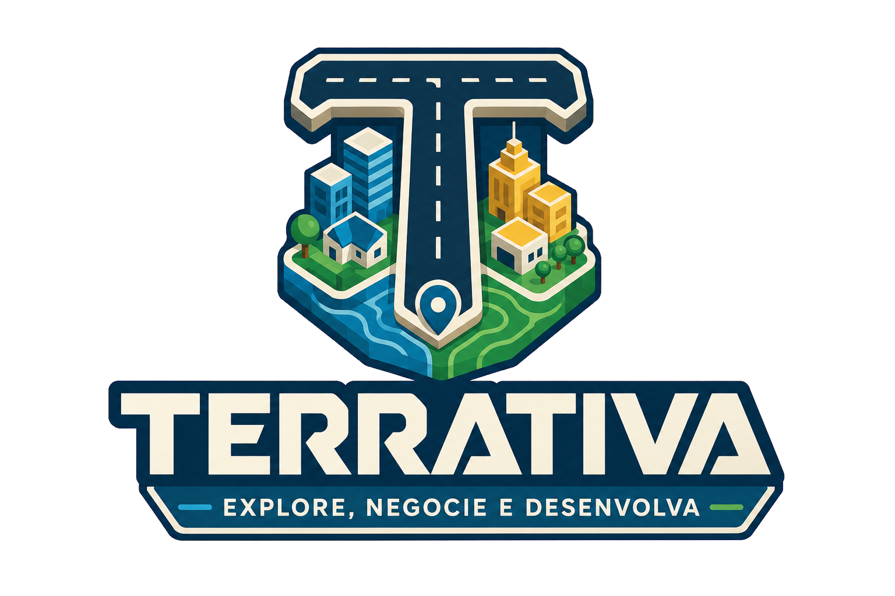
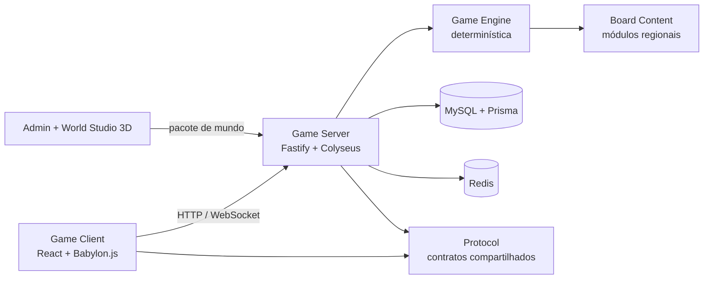

<div align="center">
  

  # Terrativa

  **Uma plataforma open source de estratégia, território e educação financeira em mundos 3D multiplayer.**

  [](https://github.com/Mateuus/terrativa/actions/workflows/ci.yml)
  [](./LICENSE)
  [](https://nodejs.org/)
  [](https://pnpm.io/)
  [](https://www.typescriptlang.org/)

  [Começar](#-começando) · [Arquitetura](#-arquitetura) · [Documentação](#-documentação) · [Contribuir](#-como-contribuir)
</div>

---

> [!IMPORTANT]
> Terrativa está em desenvolvimento ativo e ainda não é indicada para produção. Não há dinheiro real, apostas, prêmios financeiros ou conversão da moeda interna.

## 🌎 Sobre o projeto

Terrativa combina um jogo de tabuleiro estratégico, exploração de territórios e administração de propriedades com uma experiência 3D executada no navegador. O servidor é autoritativo: turnos, dados, movimento, saldo e regras são validados no backend.

O primeiro território oficial é **Terrativa: Baixada Santista**. A plataforma foi projetada para receber outros mundos e módulos regionais criados pela comunidade sem alterar o núcleo do jogo.

### Principais recursos

- tabuleiro 3D com terreno, água, construções, veículos, personagens e animações;
- partidas multiplayer com salas públicas ou privadas, lobby, reconexão e chat;
- engine TypeScript determinística para regras, turnos, propriedades e ranking;
- servidor Fastify + Colyseus com autenticação, rate limiting e estado autoritativo;
- conteúdo regional validado, importável e exportável;
- **World Studio 3D** integrado ao painel administrativo;
- edição de Landscape, rios, lagos, rotas, assets, materiais e scripts;
- Organizador hierárquico com pastas, subpastas e seleção múltipla;
- autosave, histórico com desfazer/refazer e pacotes de mundo para o servidor;
- monorepo tipado, testado e validado por integração contínua.

## 🧭 Aplicações

| Aplicação | Pacote | Porta | Responsabilidade |
| --- | --- | ---: | --- |
| Jogo | `@terrativa/game-client` | `5173` | Cliente React/Vite, HUD, lobby e mundo 3D |
| Administração | `@terrativa/admin-web` | `5174` | Painel geral e World Studio 3D |
| Servidor | `@terrativa/game-server` | `2567` | HTTP, autenticação, Colyseus e partidas |
| Sandbox Babylon | `apps/game-client-babylon` | variável | Projeto experimental de integração com Babylon.js Editor |

## 🧱 Arquitetura



O workspace é dividido em aplicações e pacotes com limites claros:

```text
apps/
├── admin-web/              # administração e editor de mundos 3D
├── game-client/            # jogo web
├── game-client-babylon/    # sandbox experimental do Babylon.js Editor
└── game-server/            # API e servidor multiplayer

packages/
├── board-content/          # mapas, cartas e módulos regionais
├── config/                 # configuração compartilhada
├── database/               # Prisma, migrations e seed
├── game-engine/            # regras puras e determinísticas
├── protocol/               # schemas e mensagens da rede
└── ui/                     # componentes visuais compartilhados
```

Leia a visão completa em [Docs/ARCHITECTURE.md](./Docs/ARCHITECTURE.md).

## 🛠️ Tecnologias

- **Frontend:** React 19, TypeScript, Vite, Babylon.js e MapLibre;
- **Multiplayer:** Colyseus sobre WebSocket;
- **Backend:** Node.js, Fastify e Zod;
- **Dados:** MySQL 8, Prisma e Redis;
- **Qualidade:** Biome, Vitest, TypeScript strict e GitHub Actions;
- **Workspace:** pnpm e Turborepo;
- **Infraestrutura local:** Docker Compose.

## 🚀 Começando

### Pré-requisitos

- Node.js `22.15+` ou Node.js 24 LTS;
- pnpm `11.17+` por meio do Corepack;
- MySQL 8 e Redis, instalados localmente ou executados pelo Docker;
- Git e Docker Desktop, caso utilize os containers.

### 1. Clone e instale

```bash
git clone https://github.com/Mateuus/terrativa.git
cd terrativa
corepack enable
corepack pnpm install
```

Se o Windows não permitir `corepack enable`, continue usando `corepack pnpm` nos comandos.

### 2. Configure o ambiente

No Windows PowerShell:

```powershell
Copy-Item .env.example .env
```

No Linux ou macOS:

```bash
cp .env.example .env
```

Substitua todos os valores `CHANGE_ME` e gere segredos com pelo menos 32 bytes para `ACCESS_TOKEN_SECRET` e `REFRESH_TOKEN_PEPPER`. Nunca publique o arquivo `.env`.

### 3. Inicie MySQL e Redis

Com Docker:

```bash
corepack pnpm docker:up
```

O `compose.yaml` publica o MySQL na porta `3307`. Nesse modo, use `DB_PORT=3307` no `.env`. Redis permanece na porta `6379`.

### 4. Prepare o banco

```bash
corepack pnpm db:generate
corepack pnpm db:deploy
corepack pnpm db:seed-foundation
```

O seed é explícito e idempotente. Ele prepara o conteúdo oficial da Baixada Santista.

### 5. Execute o workspace

```bash
corepack pnpm dev
```

Depois acesse:

- jogo: <http://localhost:5173>;
- World Studio: <http://localhost:5174>;
- API e multiplayer: <http://localhost:2567>;
- Adminer opcional: `docker compose --profile development up -d adminer`, em <http://localhost:8080>.

Para executar somente uma aplicação:

```bash
corepack pnpm dev:client
corepack pnpm dev:admin
corepack pnpm dev:server
```

## 🎛️ World Studio 3D

O Studio segue uma organização inspirada em editores 3D profissionais:

- `WASD` move a câmera e `Q/E` controla a altura;
- botão direito + mouse gira a câmera;
- `1`, `2` e `3` alternam entre mover, girar e escalar;
- `Ctrl` + clique seleciona vários objetos;
- `Ctrl+C`, `Ctrl+V` e `Ctrl+D` copiam, colam e duplicam;
- `Delete` remove objetos editáveis;
- `Ctrl+Z` e `Ctrl+Y` desfazem e refazem;
- `Ctrl+S` salva o mundo atual;
- a Gaveta de Conteúdo separa assets do mundo e da Engine;
- o Organizador aceita pastas, subpastas e grupos recolhíveis;
- o Landscape pode ser elevado, abaixado, suavizado e achatado.

Detalhes em [Docs/PHASE_9_WORLD_STUDIO.md](./Docs/PHASE_9_WORLD_STUDIO.md).

## ✅ Qualidade

Antes de abrir um Pull Request, execute:

```bash
corepack pnpm validate
```

Esse comando executa typecheck, lint, testes e build em todo o workspace. Comandos individuais:

| Comando | Resultado |
| --- | --- |
| `corepack pnpm typecheck` | valida os tipos |
| `corepack pnpm lint` | verifica estilo e problemas estáticos |
| `corepack pnpm test` | executa a suíte Vitest |
| `corepack pnpm build` | gera os builds de produção |
| `corepack pnpm format` | formata os arquivos suportados |

## 📚 Documentação

- [Índice técnico](./Docs/README.md)
- [Arquitetura](./Docs/ARCHITECTURE.md)
- [Regras do jogo](./Docs/GAME_RULES.md)
- [Protocolo WebSocket](./Docs/WEBSOCKET_PROTOCOL.md)
- [Banco de dados](./Docs/DATABASE.md)
- [Segurança](./Docs/SECURITY.md)
- [Implantação](./Docs/DEPLOYMENT.md)
- [Roadmap](./Docs/ROADMAP.md)
- [Módulos da comunidade](./Docs/COMMUNITY_MODULES.md)
- [Pesquisa e licenças de assets](./Docs/ASSET_RESEARCH.md)
- [Decisões arquiteturais](./Docs/adr/)

## 🤝 Como contribuir

Contribuições de código, documentação, testes, arte, áudio, traduções e módulos regionais são bem-vindas.

1. Leia o [guia de contribuição](./CONTRIBUTING.md) e o [Código de Conduta](./CODE_OF_CONDUCT.md).
2. Procure uma issue existente ou abra uma proposta antes de mudanças grandes.
3. Crie uma branch a partir de `main`.
4. Implemente uma alteração focada, acompanhada de testes e documentação.
5. Execute `corepack pnpm validate`.
6. Abra um Pull Request preenchendo o template.

Ao contribuir, você concorda que sua contribuição será distribuída sob a licença MIT do projeto.

## 🔐 Segurança

Não abra uma issue pública para vulnerabilidades. Consulte [SECURITY.md](./SECURITY.md) para conhecer o processo de divulgação responsável.

## 🎨 Assets de terceiros

Os assets mantêm suas licenças originais e possuem arquivos de licença próximos aos respectivos conteúdos. O catálogo atual inclui materiais CC0 de:

- [Kenney](https://kenney.nl/);
- [Quaternius](https://quaternius.com/);
- [OpenGameArt](https://opengameart.org/).

A licença MIT do código **não substitui** as licenças individuais dos assets.

## 📄 Licença

O código original da Terrativa é distribuído sob a [Licença MIT](./LICENSE).

Copyright © 2026 Mateus Rodrigues e contribuidores da Terrativa.

